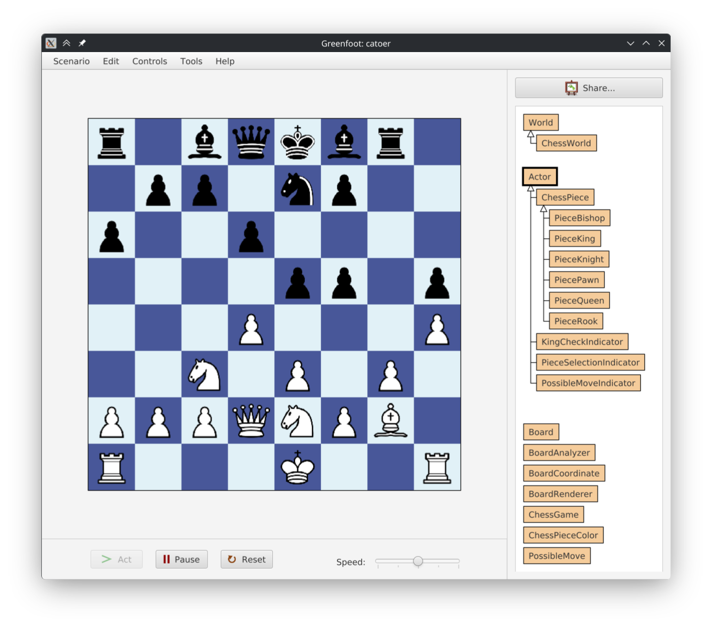

  <ul style="list-style: none;">
    

      <h1>♟️ catoer</h1>
    

  </ul>

Chess implemented in [greenfoot](https://greenfoot.org/). Final assignment for
UMS TIF3221307 "Visual Programming" course.

This greenfoot chess game is very much playable. It implements basic piece move
analysis based off of the standard chess rules in order to determine legal
moves (e.g. can't move into check). Though there are special cases like en
passant and castling that hasn't been implemented (yet).

There's also board flipping on different turns, this setting can be toggled
on/off in the `ChessGame.java` file (specifically the `ENABLE_FLIPPING_TURNS`
final static variable).

To the unassuming people that discovered this repo by chance, who might be
asking why there isn't any proper code organization: you're right, problem is
that greenfoot can't seem to discover the files under a folder. I do not fully
understand how it works, it doesn't even seem to require a `package` directive
on the top of each java classes. So yeah, it _is_ messy.

To-Do list:

 - [ ] Implement en passant
 - [ ] Implement castling
 - [ ] Add a timer
 - [ ] Piece movement animation
 - [ ] Drag-and-drop for piece movement
 - [ ] Add sounds

There are also a lot of other ways to optimize the game, especially with
its analyzer. This might not be the most performant chess engine you'll find.

### Try it out

The game is published on Greenfoot's website, you can play it directly
using your browser [here](https://www.greenfoot.org/scenarios/35963).

### License

This project is licensed under the MIT License, see the [`LICENSE`](./LICENSE)
file for details.
